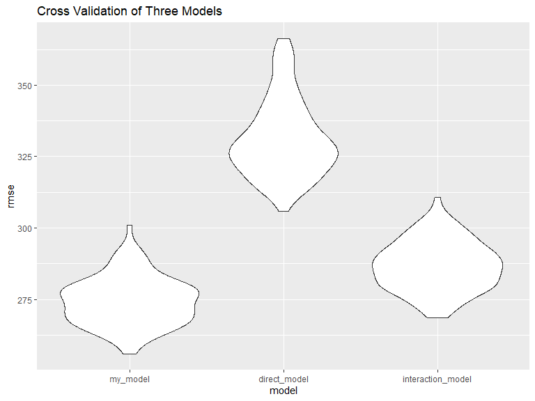
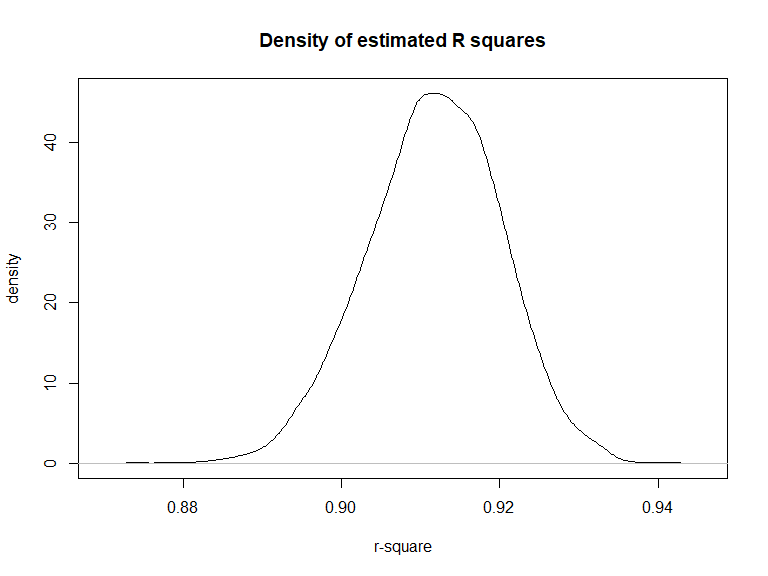

P8105\_HW6\_xc2610
================
Xuanhe Chen

## Problem 1

<!--
babysex: baby’s sex (male = 1, female = 2)
bhead: baby’s head circumference at birth (centimeters)
blength: baby’s length at birth (centimeteres)
bwt: baby’s birth weight (grams)
delwt: mother’s weight at delivery (pounds)
fincome: family monthly income (in hundreds, rounded)
frace: father’s race (1 = White, 2 = Black, 3 = Asian, 4 = Puerto Rican, 8 = Other, 9 = Unknown)
gaweeks: gestational age in weeks
malform: presence of malformations that could affect weight (0 = absent, 1 = present)
menarche: mother’s age at menarche (years)
mheigth: mother’s height (inches)
momage: mother’s age at delivery (years)
mrace: mother’s race (1 = White, 2 = Black, 3 = Asian, 4 = Puerto Rican, 8 = Other)
parity: number of live births prior to this pregnancy
pnumlbw: previous number of low birth weight babies
pnumgsa: number of prior small for gestational age babies
ppbmi: mother’s pre-pregnancy BMI
ppwt: mother’s pre-pregnancy weight (pounds)
smoken: average number of cigarettes smoked per day during pregnancy
wtgain: mother’s weight gain during pregnancy (pounds)
-->

``` r
# load data
birthweight_data = 
  read_csv("./data/birthweight.csv")
```

    ## Rows: 4342 Columns: 20

    ## -- Column specification --------------------------------------------------------
    ## Delimiter: ","
    ## dbl (20): babysex, bhead, blength, bwt, delwt, fincome, frace, gaweeks, malf...

    ## 
    ## i Use `spec()` to retrieve the full column specification for this data.
    ## i Specify the column types or set `show_col_types = FALSE` to quiet this message.

First I turned catagorical data in factors.

``` r
birthweight_data <-
  birthweight_data %>%
  mutate(
    babysex = factor(babysex),
    frace = factor(frace),
    mrace = factor(mrace)) %>%
  mutate(
    babysex = fct_infreq(babysex),
    frace = fct_infreq(frace),
    mrace = fct_infreq(mrace))
```

After researching on most possible factors of baby weight, I chose some
variables and made a model. This model is based on hypothesized
structure, and no interations between variables.

Reference: Metgud, Chandra S et al. “Factors affecting birth weight of a
newborn–a community based study in rural Karnataka, India.” PloS one
vol. 7,7 (2012): e40040. <doi:10.1371/journal.pone.0040040>

``` r
fit = lm(bwt ~ babysex + bhead + blength + gaweeks + smoken + pnumlbw + wtgain + frace + mrace, data = birthweight_data)
```

``` r
fit %>% 
  broom::glance()
```

    ## # A tibble: 1 x 12
    ##   r.squared adj.r.squared sigma statistic p.value    df  logLik    AIC    BIC
    ##       <dbl>         <dbl> <dbl>     <dbl>   <dbl> <dbl>   <dbl>  <dbl>  <dbl>
    ## 1     0.712         0.711  275.      823.       0    13 -30546. 61122. 61217.
    ## # ... with 3 more variables: deviance <dbl>, df.residual <int>, nobs <int>

``` r
fit %>% 
  broom::tidy()
```

    ## # A tibble: 15 x 5
    ##    term        estimate std.error statistic    p.value
    ##    <chr>          <dbl>     <dbl>     <dbl>      <dbl>
    ##  1 (Intercept) -5663.     100.     -56.5     0        
    ##  2 babysex2       32.0      8.53     3.74    1.83e-  4
    ##  3 bhead         134.       3.47    38.5     4.54e-279
    ##  4 blength        77.0      2.02    38.0     3.43e-273
    ##  5 gaweeks        11.3      1.47     7.65    2.43e- 14
    ##  6 smoken         -4.53     0.591   -7.66    2.27e- 14
    ##  7 pnumlbw        NA       NA       NA      NA        
    ##  8 wtgain          3.80     0.392    9.69    5.82e- 22
    ##  9 frace2         31.0     46.5      0.667   5.05e-  1
    ## 10 frace4        -44.1     45.1     -0.978   3.28e-  1
    ## 11 frace3         24.8     69.9      0.354   7.23e-  1
    ## 12 frace8         -4.12    74.7     -0.0551  9.56e-  1
    ## 13 mrace2       -174.      46.4     -3.75    1.81e-  4
    ## 14 mrace4        -94.6     45.3     -2.09    3.70e-  2
    ## 15 mrace3       -136.      72.3     -1.88    6.07e-  2

``` r
# plot residuals along fitted values
res <- resid(fit)
plot(fitted(fit), res, main="Residuals vs. fitted values in birthweight prediction model",
        xlab="fited values",
        ylab="residuals")
abline(0,0)
```


``` r
# create a cross validation dataframe
cv_df = 
  crossv_mc(birthweight_data, 100) 
```

``` r
# check trian and test data
cv_df %>% pull(train) %>% .[[1]] %>% as_tibble
```

    ## # A tibble: 3,473 x 20
    ##    babysex bhead blength   bwt delwt fincome frace gaweeks malform menarche
    ##    <fct>   <dbl>   <dbl> <dbl> <dbl>   <dbl> <fct>   <dbl>   <dbl>    <dbl>
    ##  1 2          34      51  3629   177      35 1        39.9       0       13
    ##  2 1          34      48  3062   156      65 2        25.9       0       14
    ##  3 1          34      52  3062   157      55 1        40         0       14
    ##  4 2          34      52  3374   156       5 1        41.6       0       13
    ##  5 2          33      46  2523   126      96 2        40.3       0       14
    ##  6 2          33      49  2778   140       5 1        37.4       0       12
    ##  7 1          36      52  3515   146      85 1        40.3       0       11
    ##  8 2          35      51  3317   130      55 1        43.4       0       13
    ##  9 2          35      48  3175   158      75 1        39.7       0       13
    ## 10 1          36      53  3629   147      75 1        41.3       0       11
    ## # ... with 3,463 more rows, and 10 more variables: mheight <dbl>, momage <dbl>,
    ## #   mrace <fct>, parity <dbl>, pnumlbw <dbl>, pnumsga <dbl>, ppbmi <dbl>,
    ## #   ppwt <dbl>, smoken <dbl>, wtgain <dbl>

``` r
cv_df %>% pull(test) %>% .[[1]] %>% as_tibble
```

    ## # A tibble: 869 x 20
    ##    babysex bhead blength   bwt delwt fincome frace gaweeks malform menarche
    ##    <fct>   <dbl>   <dbl> <dbl> <dbl>   <dbl> <fct>   <dbl>   <dbl>    <dbl>
    ##  1 2          36      50  3345   148      85 1        39.9       0       12
    ##  2 1          33      52  3374   129      55 1        40.7       0       12
    ##  3 1          33      50  3459   169      75 2        40.7       0       12
    ##  4 1          35      51  3459   146      55 1        39.4       0       12
    ##  5 1          34      52  3203   134      25 1        41.1       0       14
    ##  6 1          34      63  3175   143      25 1        41.9       0       13
    ##  7 2          35      52  3289   135      55 1        40.6       0       13
    ##  8 2          34      51  3232   155      55 1        41.6       0       15
    ##  9 2          33      49  3147   140      45 1        40.6       0       12
    ## 10 1          33      51  3345   140      85 1        38.6       0       13
    ## # ... with 859 more rows, and 10 more variables: mheight <dbl>, momage <dbl>,
    ## #   mrace <fct>, parity <dbl>, pnumlbw <dbl>, pnumsga <dbl>, ppbmi <dbl>,
    ## #   ppwt <dbl>, smoken <dbl>, wtgain <dbl>

``` r
cv_df =
  cv_df %>% 
  mutate(
    train = map(train, as_tibble),
    test = map(test, as_tibble))
```

``` r
# cross validation on the three models
cv_df = 
  cv_df %>% 
  mutate(
    fit  = map(train, ~lm(bwt ~ babysex + bhead + blength + gaweeks + smoken + pnumlbw + wtgain + frace + mrace, data = birthweight_data)),
    fit_com1  = map(train, ~lm(bwt ~ blength + gaweeks, data = birthweight_data)),
    fit_com2  = map(train, ~ lm(bwt ~ babysex + bhead + blength 
              + babysex * bhead
              + bhead * blength
              + babysex * blength
              + babysex * bhead * blength, data = birthweight_data)))%>% 
  mutate(
    rmse_my_model = map2_dbl(fit, test, ~rmse(model = .x, data = .y)),
    rmse_direct_model = map2_dbl(fit_com1, test, ~rmse(model = .x, data = .y)),
    rmse_interaction_model = map2_dbl(fit_com2, test, ~rmse(model = .x, data = .y)))
```

The results shows my model has the best behavior

``` r
cv_df %>% 
  select(starts_with("rmse")) %>% 
  pivot_longer(
    everything(),
    names_to = "model", 
    values_to = "rmse",
    names_prefix = "rmse_") %>% 
  mutate(model = fct_inorder(model)) %>% 
  ggplot(aes(x = model, y = rmse)) + geom_violin() + ggtitle("Cross Validation of Three Models")
```



## Problem 2

``` r
#get data
weather_df = 
  rnoaa::meteo_pull_monitors(
    c("USW00094728"),
    var = c("PRCP", "TMIN", "TMAX"), 
    date_min = "2017-01-01",
    date_max = "2017-12-31") %>%
  mutate(
    name = recode(id, USW00094728 = "CentralPark_NY"),
    tmin = tmin / 10,
    tmax = tmax / 10) %>%
  select(name, id, everything())
```

``` r
# function to obtain R-Squared from the data
rsq <- function(formula, data, indices) {
  d <- data[indices,] # allows boot to select sample
  fit <- lm(formula, data=d)
  return(summary(fit)$r.square)
}
# bootstrapping with 5000 replications
estimate_rsq <- boot(data= weather_df, statistic=rsq,
   R=5000, formula= tmax ~ tmin)
```

``` r
# plot results
density_rsq <- density(estimate_rsq[[2]])
plot(density_rsq, main="Density of estimated R squares",
        xlab="r-square",
        ylab="density")
```



``` r
# get 95% confidence interval
boot.ci(estimate_rsq, type="bca")
```

    ## BOOTSTRAP CONFIDENCE INTERVAL CALCULATIONS
    ## Based on 5000 bootstrap replicates
    ## 
    ## CALL : 
    ## boot.ci(boot.out = estimate_rsq, type = "bca")
    ## 
    ## Intervals : 
    ## Level       BCa          
    ## 95%   ( 0.8935,  0.9264 )  
    ## Calculations and Intervals on Original Scale

``` r
# function to obtain regression weights
bs <- function(formula, data, indices) {
  d <- data[indices,] # allows boot to select sample
  fit <- lm(formula, data=d)
  return(coef(fit))
}

# bootstrapping with 5000 replications
estimate_coef <- boot(data = weather_df, statistic=bs,
   R=5000, formula= tmax ~ tmin)
```

``` r
# get interested data from bootstrap result
coef_df <- estimate_coef[[2]]
coef_df <- data.table::as.data.table(coef_df)
```

``` r
# calculate the log estimate of each bootstrap result
coef_df <-
coef_df %>%
  mutate (
    log_val = log(V1*V2)
  )
```

``` r
# plot the estimates
ggplot(coef_df, aes(x = log_val)) + geom_density() + ggtitle("Density of estimate log(β_0∗β_1)") + xlab("log(β_0∗β_1)") + ylab("density")
```


``` r
# view results
error <- qt(0.975, df=length(coef_df$log_val)-1)*sd(coef_df$log_val)/sqrt(length(coef_df$log_val))
lower <- mean(coef_df$log_val)-error
upper <- mean(coef_df$log_val)+error
print(lower)
```

    ## [1] 2.012334

``` r
print(upper)
```

    ## [1] 2.01364

We can see both the distribution of estimated R^2 and estimated
log(β\_0∗β\_1) and normally distributed,with mean around 0.91 and 2.01.
These results meet the central limit theorem.

The 95% CI of estimated R^2 are \[0.8937, 0.9271\], and of estimated
log(β\_0∗β\_1) are \[2.012137, 2.013479\]
